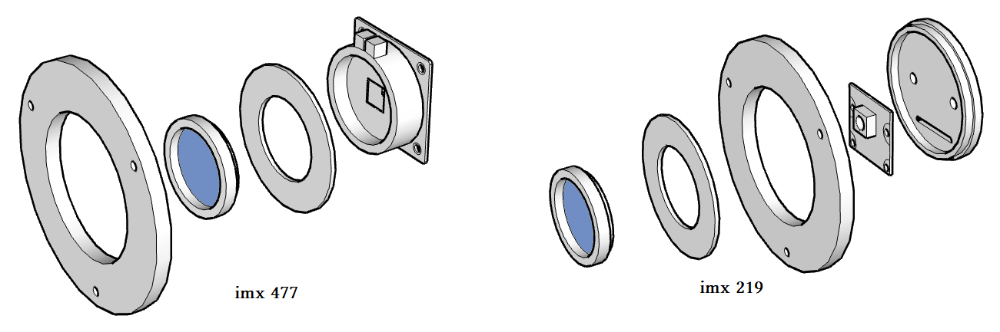
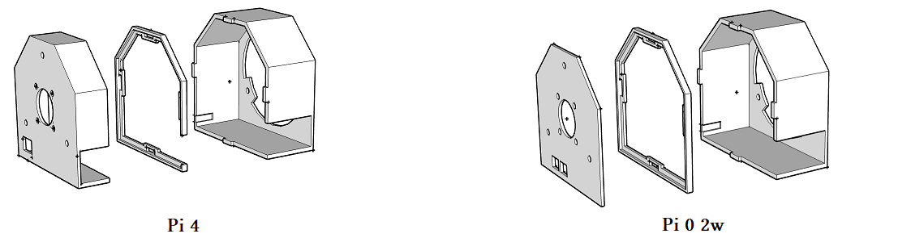
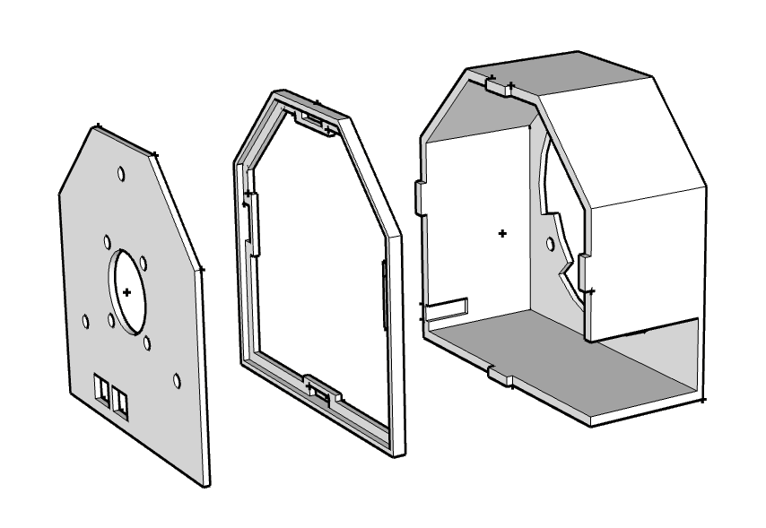

# CMOS for astronomy

# Design
Design of a CMOS camera based on the imx219, imx477 or (imx290/imx296 untested) sensors

# Schemes

### Camera head

	The camera heads are made with:
		A T2 tilt plate
		A T2 plug (imx219 or imx290)
		A UV/IR-cut filter
		A T2/M28 adapter ring

### Raspberry Pi 4

	
	box_main_imx.stl
	clip_imx.stl 
	box_cover_imx.stl
	Or	
	clip_imx_2w.stl 
	box_cover_imx_2w.stl

### Raspberry Pi 2w (untested)

	box_main_imx.stl
	clip_imx_2w.stl 
	box_cover_imx_2w.stl
	
# Software & facilities

### OS Raspbian bookworm or Bullseyes 
	Default facility.
	
### Libcamera
	Included in distributions.
	Checked the prerequisites for the /boot/info.txt file.
	test:
		>libcamera-still --list-cameras
	
### Indilib
	Default facility, recompile if necessary.
	
### Jupyter & JupyterLab
	Create a python environment with options : --system-site-packages
		>python3 -m venv --system-site-packages astropy
		
	Connect to your python environment (automatically in the .bashrc file if installed).
	Default facility.
		>pip install jupyter
		>pip install jupyterlab
		
### Astropy & astroquery
	Connect to your python environment.
	Default facility.
		>pip install astropy astroquery
		
### Indi_pylibcamera
	Connect to your python environment.
	Default facility without "sudo" and validate with the root password during the administrator request.
		>pip install indi-pylibcamera
	And
		>sudo indi_pylibcamera_postinstall
		
	Launching the Indilib server to see the execution.
		>indiserver indi_pylibcamera
		
		
# Conclusion