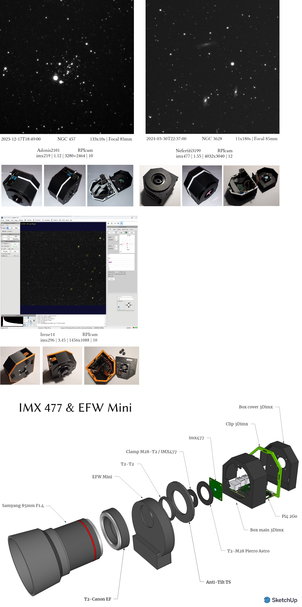

# CMOS for astronomy

# Design
Design of a CMOS camera based on the imx219, imx477, imx296 or (imx290 untested) sensors

# Schemes

### Camera head

	The camera heads are made with:
		A T2 anti-tilt plate
		A T2 plug (imx219 or imx290)
		A UV/IR-cut filter (preferably Player One Astronomy)
		A T2/M28 adapter ring (Pierro Astro)

### Raspberry Pi

	
	3D/box_main_imx.stl
	3D/clip_imx.stl 
	3D/box_cover_imx.stl
	Or	
	3D/clip_imx_2w.stl 
	3D/box_cover_imx_2w.stl

### RaspiCam 2026 (Pi 4 or Pi Zero 2W)

	
	3D/camera_imx477.stl
	3D/camera_imx477_cover.stl
	3D/spacer_imx477.stl
	3D/nut_imx477.stl
	Or
	3D/cammini_imx477.stl
	3D/cammini_imx477_cover.stl
	
# Software & facilities

### OS Raspbian bookworm, Bullseyes or Trixie
	Default facility.
	
	For Raspberry Pi 2w upgrade swapfile (not for Trixie)
	File /etc/dphys-swapfile
		CONF_SWAPSIZE=2048
	Reconfigure
		>sudo dpkg-reconfigure dphys-swapfile
		
	For Trixie
	Edit file /etc/rpi/swap.conf
	Replace values and reboot:
	
	[Main]
	Mechanism=swapfile
	
	[File]
	Path=/var/swap
	RamMultiplier=1
	MaxSizeMiB=4096
	MaxDiskPercent=50
	FixedSizeMiB=4096
	
### Libcamera
	Included in distributions.
	test for bookworm and Bullseyes:
		>libcamera-still --list-cameras
	
### Indilib 
	Default facility for bookworm and Bullseyes (recompile if necessary).
		>sudo apt install indi-bin
		>sudo apt install indi-asi
		>sudo apt install indi-eqmod
		
### Indilib for Trixie
	Install indilib and compile 
[Indilib](https://github.com/indilib/indi)

	Install indi-3rdparty and compile (Do not instal libindi-dev) 
[Indi-3rdparty](https://github.com/indilib/indi-3rdparty)
	
### Jupyter & JupyterLab
	Create a python environment with options : --system-site-packages
		>python3 -m venv --system-site-packages astropy
		
	Connect to your python environment (automatically in the .bashrc file if installed).
	Default facility.
		>pip install pip -U
		>pip install setuptools -U
		>pip install jupyter -U
				
### Astropy & astroquery
	Connect to your python environment.
	Default facility.
		>pip install astropy 
		>pip install astroquery==0.4.7
		
### Indi_pylibcamera
	Connect to your python environment.
	Default facility.
		>pip install indi-pylibcamera
		
	For camera information
		>indi_pylibcamera_print_camera_information
			
	Launching the Indilib server to see the execution.
		>indiserver indi_pylibcamera
		
		
# The shoot

# Raspicam 2026 shoot
