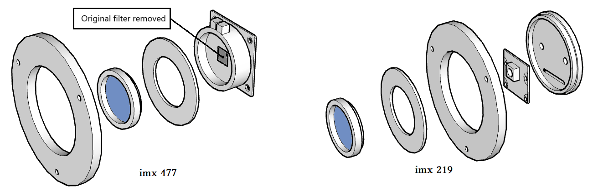

# CMOS for astronomy

# Design
Design of a CMOS camera based on the imx219, imx477, imx296 or (imx290 untested) sensors

# Schemes

### Camera head

	The camera heads are made with:
		A T2 anti-tilt plate
		A T2 plug (imx219 or imx290)
		A UV/IR-cut filter (preferably Player One Astronomy)
		A T2/M28 adapter ring (Pierro Astro)

### Raspberry Pi

	
	box_main_imx.stl
	clip_imx.stl 
	box_cover_imx.stl
	Or	
	clip_imx_2w.stl 
	box_cover_imx_2w.stl
	
# Software & facilities

### OS Raspbian bookworm or Bullseyes 
	Default facility.
	For Raspberry Pi 2w upgrade swapfile
	File /etc/dphys-swapfile
		CONF_SWAPSIZE=2048
	Reconfigure
		>sudo dpkg-reconfigure dphys-swapfile
	
### Libcamera
	Included in distributions.
	test:
		>libcamera-still --list-cameras
	
### Indilib
	Default facility, recompile if necessary.
		>sudo apt install libindi1 indi-bin
		>sudo apt install indi-asi
		>sudo apt install indi-eqmod
	
### Jupyter & JupyterLab
	Create a python environment with options : --system-site-packages
		>python3 -m venv --system-site-packages astropy
		
	Connect to your python environment (automatically in the .bashrc file if installed).
	Default facility.
		>pip install pip -U
		>pip install setuptools -U
		>pip install jupyter -U
		>pip install jupyterlab -U
		
### Astropy & astroquery
	Connect to your python environment.
	Default facility.
		>pip install astropy astroquery
		
### Indi_pylibcamera
	Connect to your python environment.
	Default facility.
		>pip install indi-pylibcamera
			
	Launching the Indilib server to see the execution.
		>indiserver indi_pylibcamera
		
		
# The shoot
